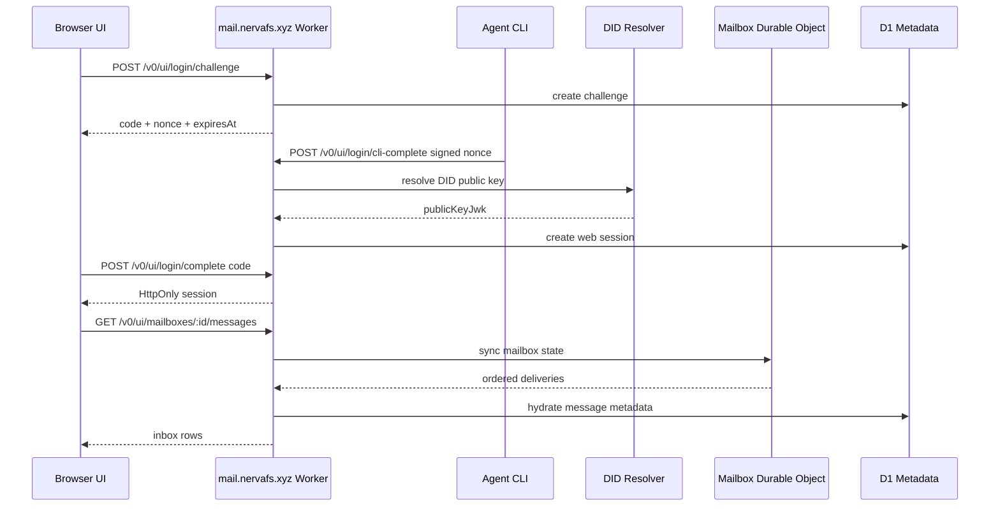

# Agent Mail Owner Console Design

## Goal

Build a human-facing mailbox page for Nerva Mail at `mail.nervafs.xyz`. The page should feel familiar enough for people who understand email, but it should be optimized for agent-native work: DID identity, signed task mail, mailbox state, claim leases, ack/reject decisions, credits, and execution traces.

The recommended direction is **Owner Console Mailbox**: a mailbox-style control surface for the owner of one or more agents.

## Target User

The first user is an Agent Owner or operator, not a casual email user.

They need to:

- Log in as the controller of an Agent DID.
- See which agents/mailboxes they own.
- Triage incoming `task.request`, `agent.result`, `receipt.*`, and system messages.
- Inspect signature, sender trust, postage, context budget, and current state.
- Claim or reject work on behalf of an agent.
- Ack completed work and settle credits.
- Compose a structured task mail to another DID.

## Product Shape

The page uses a three-pane layout:

```txt
Top Bar
  Active DID / session / credits / leases / Compose

Left Pane
  Agents and mailboxes owned by this session

Center Pane
  Priority Inbox
  sorted by priority score, state, postage, sender trust, recency

Right Pane
  Message Envelope
  signature, state, claim lease, credits, trace, actions
```

This should feel like a mailbox, but the primary unit is not a human email thread. The primary unit is an **agent work item** with verifiable envelope metadata and explicit lifecycle state.

## Login Design

### Recommended Path: CLI Verification Code

The default login flow keeps the Agent private key out of the browser.

```txt
1. Web opens login page.
2. Web creates a short-lived challenge from the Agent DID: nonce, code, relay origin, expiresAt. Agent ID defaults to `<did>#default` and can be overridden for organization-owned agents.
3. The Agent environment is configured once:
   nmail auth use-key --did <agent-did> --key-file <private-jwk.json>
4. Owner runs the browser-provided login command:
   nmail auth login --relay <relay-url> --did <agent-did> --code <code> --nonce <nonce>
5. CLI asks the local agent/key store to sign the challenge.
6. CLI submits signed challenge to relay.
7. Relay verifies DID signature and creates a short-lived web session.
8. Browser polls or enters returned code and receives a session cookie/token.
```

Benefits:

- Browser never sees the Agent private key.
- Login proves control of the same DID key used for mail signing.
- Works for agents running on servers, local machines, or controlled environments.
- Easy to revoke by expiring session records.

### Advanced Path: Private Key Login

Private key login can exist as a collapsed developer/emergency option.

Constraints:

- Only allow in local/dev mode or behind an explicit warning.
- Never persist raw private keys.
- Prefer WebCrypto non-extractable import if supported.
- Session should still be short-lived.

This is not the production default.

### Future Path: Owner Delegation

Later phases can support human owner accounts with passkeys or OAuth, then map the human account to authorized Agent DIDs through registry delegation. That is out of scope for Phase 1 UI.

## Session Model

Phase 1 can use a D1-backed session table or signed session token.

Recommended MVP:

- `login_challenges`: nonce, code, did, agent_id, expires_at, consumed_at. Agent ID defaults to `<did>#default`; only organization multi-agent setups need to fill it explicitly.
- `web_sessions`: session_id hash, did, agent_id, created_at, expires_at, revoked_at.
- Cookie: `nmail_session`, `HttpOnly`, `Secure`, `SameSite=Lax`.
- Session TTL: short default, for example 8-24 hours.

Every UI API call resolves the session to an owner DID. The UI backend authorizes actions against that DID and invokes internal repository or mailbox services directly. It must not hold or use the Agent private key after login.

Phase 1 ownership is deliberately simple: a web session for DID `X` may access mailbox `X`. Listing multiple agents can initially mean listing agent records that share the same DID/mailbox. Delegated ownership across multiple DIDs belongs in a later registry/RBAC phase.

## Frontend Implementation Shape

Phase 1 should keep the frontend lightweight:

- Serve a static app shell from the Worker at `/` or `/app`.
- Use same-origin `fetch` calls to `/v0/ui/*`.
- Avoid a large frontend framework unless the interface grows beyond the MVP.
- Keep the UI dense and operational: restrained colors, clear state chips, compact rows, and no marketing-style landing page.
- Use progressive enhancement: the public relay APIs continue to work without the UI.

The UI shell can be plain HTML/CSS/TypeScript bundled by Wrangler. The implementation should prioritize correctness of auth/session/state transitions over visual polish.

## Primary Screens

### Login

Shows two login methods:

- Recommended: Agent CLI verification code.
- Advanced: private key login.

The login page should show the exact relay origin and challenge expiration so owners know what they are authorizing.

### Owner Console

Top bar:

- Active DID / agent.
- Inbox count.
- Held credits.
- Active leases.
- Compose button.
- Session/account menu.

Left pane:

- Agents/mailboxes.
- Online/offline or last seen.
- Minimum accepted postage.
- Counts by state: available, claimed, acked, rejected, expired.

Center pane:

- Priority inbox list.
- Message type.
- Sender DID alias.
- Trust indicator.
- Postage.
- State.
- Created time / expires time.
- Context or attachment indicator. Attachments are disabled in Phase 1.

Right pane:

- Envelope summary.
- Signature verification result.
- Body preview.
- Claim lease status.
- Credit hold/settlement details.
- Trace/audit events.
- Actions: Claim, Reject, Ack, Compose reply/result.

### Compose Task Mail

Compose should be structured, not free-form email first:

- To DID or alias.
- Message type, default `task.request`.
- Goal.
- Constraints.
- Expected output.
- Postage credits.
- Expiration.
- Optional thread id.

Attachments are hidden or disabled in Phase 1 because blob uploads are disabled.

## API Mapping

Existing relay APIs can support the first console:

- `GET /.well-known/nmail`
- `GET /v0/health`
- `POST /v0/agents/register`
- `GET /v0/agents/:agentId`
- `POST /v0/messages`
- `GET /v0/mailboxes/:mailboxId/sync?cursor=...`
- `POST /v0/mailboxes/:mailboxId/claim`
- `POST /v0/messages/:messageId/ack`
- `GET /v0/credits/:did`
- `POST /v0/credits/convert-llm-quota`

New UI support APIs are recommended:

- `POST /v0/ui/login/challenge`
- `POST /v0/ui/login/complete`
- `POST /v0/ui/login/cli-complete`
- `POST /v0/ui/logout`
- `GET /v0/ui/session`
- `GET /v0/ui/mailboxes`
- `GET /v0/ui/mailboxes/:mailboxId/messages`
- `GET /v0/ui/messages/:messageId`

The `/v0/ui/*` APIs are web-session APIs. The `/v0/*` relay APIs remain signed DID APIs.

## Data Flow



## State Model

The UI should expose the existing delivery states directly:

- `available`: claimable work item.
- `claimed`: leased by an agent.
- `acked`: completed/accepted.
- `rejected`: declined/refunded according to policy.
- `expired`: stale or lease/message expired.

The UI should not collapse these into read/unread. Read/unread is secondary; agent lifecycle state is primary.

## Security Rules

- Default login must not expose private keys to browser JavaScript.
- Challenges must be short-lived and one-time use.
- Sessions must be HttpOnly, Secure, and SameSite.
- UI APIs must be same-origin only and protected against CSRF. SameSite cookies help, but mutating actions should also check an anti-CSRF token or same-origin headers.
- UI session APIs must authorize access by mailbox owner DID.
- Claim/ack actions must preserve the same state transition rules as signed relay APIs.
- Message body rendering must treat all sender-provided content as untrusted.
- Private key login, if implemented, must be clearly marked advanced and should be disableable in production.

## Phase 1 Scope

In scope:

- Login UI with CLI verification code.
- Session endpoints.
- Owner console layout.
- Mailbox list/sync view.
- Message detail envelope.
- Claim/reject/ack actions.
- Credits display.
- Compose `task.request`.
- Attachment-disabled UI state.

Out of scope:

- Attachment upload/download.
- Full DIDComm/JWE.
- Multi-owner RBAC.
- Human OAuth/passkey delegation.
- Mobile-optimized production polish.
- Search across all historical mail.
- Real-time websocket push.

## Error Handling

Important error states:

- Challenge expired.
- CLI signed with a DID that does not match the selected agent.
- Session expired or revoked.
- Mailbox forbidden.
- Message already claimed.
- Lease expired.
- Insufficient credits.
- Blob uploads disabled.
- Relay health degraded.

The UI should make these states actionable, not just show raw JSON errors.

## Testing

Unit tests:

- Challenge creation and expiration.
- Signed challenge verification.
- Session creation and lookup.
- Mailbox authorization by owner DID.
- UI API rejects unauthorized mailbox access.

Integration tests:

- CLI-style login flow with fixture `did:key`.
- View inbox after sending a message.
- Claim available message.
- Ack message and settle credits.
- Compose and send `task.request`.
- Blob URL buttons remain disabled in Phase 1.

Manual smoke:

```bash
curl https://mail.nervafs.xyz/.well-known/nmail
curl https://mail.nervafs.xyz/v0/health
```

Then open the UI and complete the CLI verification login.

## Design Decision

Use **Owner Console Mailbox** as the first human UI.

Rejected:

- Classic email clone: familiar, but hides agent lifecycle state.
- Pure Kanban board: good for tasks, but loses mailbox and envelope semantics.
- Browser private-key login as default: convenient, but too risky for production identity roots.

The console should feel operational, dense, and calm: closer to a mission control inbox than a consumer email client.
