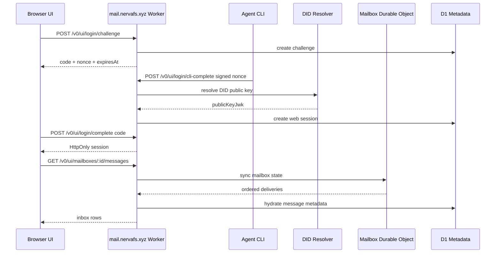

# Agent Mail Owner Console 中文设计稿

## 目标

在 `mail.nervafs.xyz` 上构建一个面向人类的 Nerva Mail 邮箱页面。这个页面需要保留一部分传统邮箱的熟悉感，但它的核心不是普通人类邮件，而是 Agent 原生工作流：DID 身份、签名任务邮件、mailbox 状态、claim lease、ack/reject 决策、积分和执行 trace。

推荐方向是 **Owner Console Mailbox**：一个邮箱形态的 Agent Owner 控制台。

## 目标用户

第一版用户是 Agent Owner 或 Agent operator，而不是普通邮件用户。

他们需要：

- 作为某个 Agent DID 的控制者登录。
- 查看自己拥有或管理的 Agent / mailbox。
- 处理进入 mailbox 的 `task.request`、`agent.result`、`receipt.*` 和系统消息。
- 检查签名、发送方可信度、postage、上下文预算和当前状态。
- 代表 Agent claim 或 reject 工作。
- ack 已完成工作并触发积分结算。
- 向另一个 DID 发送结构化任务邮件。

## 产品形态

页面采用三栏结构：

```txt
Top Bar
  当前 DID / session / credits / leases / Compose

Left Pane
  当前 session 拥有或可管理的 agents 和 mailboxes

Center Pane
  Priority Inbox
  按 priority score、状态、postage、sender trust、时间排序

Right Pane
  Message Envelope
  签名、状态、claim lease、积分、trace、操作
```

它应该“像邮箱”，但第一信息单元不是人类邮件 thread，而是一个 **Agent work item**：带可验证 envelope metadata 和明确 lifecycle state 的任务对象。

## 登录设计

### 推荐路径：CLI 验证码登录

默认登录流程必须让 Agent private key 留在浏览器之外。

```txt
1. Web 打开登录页。
2. Web 基于 Agent DID 创建短期 challenge，但只向人类展示 code。Agent ID 默认推导为 `<did>#default`，高级组织场景可手动覆盖。
3. Agent 环境首次运行：
   nmail auth use-key --did <agent-did> --key-file <private-jwk.json>
4. Owner 只把 code 告诉 Agent。
5. Agent 运行：
   nmail auth login --code <code>
6. CLI 自动解析 challenge nonce，请求本地 agent/key store 对 challenge 签名，并提交给 relay。
7. Relay 验证 DID 签名，并把 challenge 标记为已完成。
8. Browser 自动轮询 challenge completion endpoint，创建短期 web session，并拿到 session cookie/token。
```

好处：

- 浏览器永远看不到 Agent private key。
- 登录证明 Owner 控制的是同一个用于 Agent Mail 签名的 DID key。
- 适用于本机 Agent、服务器 Agent 或受控运行环境。
- session 过期或撤销即可收回访问权。

### 高级路径：Private Key Login

可以保留“粘贴/导入 private key 登录”作为折叠的开发者或 emergency 选项。

约束：

- 只允许在 local/dev mode，或在明确风险提示后使用。
- 永不持久化 raw private key。
- 如果浏览器支持，优先使用 WebCrypto non-extractable import。
- session 仍然必须短期有效。

这不是生产默认路径。

### 未来路径：Owner Delegation

后续阶段可以支持人类 owner 使用 passkey 或 OAuth 登录，然后通过 registry delegation 映射到可管理的 Agent DIDs。这个能力不属于 Phase 1 UI 范围。

## Session 模型

Phase 1 可以使用 D1-backed session table，也可以使用 signed session token。

推荐 MVP：

- `login_challenges`：nonce、code、did、agent_id、expires_at、consumed_at。Agent ID 默认是 `<did>#default`，只有组织多 Agent 场景需要显式填写。
- `web_sessions`：session_id hash、did、agent_id、created_at、expires_at、revoked_at。
- Cookie：`nmail_session`，`HttpOnly`，`Secure`，`SameSite=Lax`。
- Session TTL：短期有效，例如 8-24 小时。

每个 UI API 调用都会把 session 解析成 owner DID。UI backend 基于这个 DID 做授权，然后直接调用内部 repository 或 mailbox service。UI backend 不应该在登录后持有或使用 Agent private key。

Phase 1 的 ownership 有意保持简单：DID `X` 的 web session 只能访问 mailbox `X`。第一版的多 Agent 列表可以先理解为“同一个 DID/mailbox 下的 agent records”。跨 DID 的委托管理属于后续 registry/RBAC 阶段。

## 前端实现形态

Phase 1 前端应保持轻量：

- Worker 在 `/` 或 `/app` 返回一个 static app shell。
- 前端使用 same-origin `fetch` 调用 `/v0/ui/*`。
- 除非 MVP 明显变复杂，否则避免引入大型前端框架。
- UI 应该信息密度高、偏运维工作台：克制配色、清晰状态 chips、紧凑 row，不做 marketing landing page。
- 渐进增强：没有 UI 时，公开 relay API 仍然照常工作。

UI shell 可以用 plain HTML/CSS/TypeScript，由 Wrangler 一起 bundle。实现优先级应放在 auth、session、状态迁移正确性上，视觉 polish 次之。

## 主要页面

### Login

展示两种登录方式：

- 推荐：Agent CLI 验证码登录。
- 高级：private key 登录。

登录页需要展示明确的 relay origin 和 challenge 过期时间，让 owner 知道自己正在授权哪个 relay、哪个 challenge。

### Owner Console

Top bar：

- 当前 DID / agent。
- Inbox count。
- Held credits。
- Active leases。
- Compose button。
- Session/account menu。

Left pane：

- Agents / mailboxes。
- Online/offline 或 last seen。
- Minimum accepted postage。
- 按状态统计：available、claimed、acked、rejected、expired。

Center pane：

- Priority inbox list。
- Message type。
- Sender DID alias。
- Trust indicator。
- Postage。
- State。
- Created time / expires time。
- Context 或 attachment indicator。Phase 1 中附件禁用。

Right pane：

- Envelope summary。
- Signature verification result。
- Body preview。
- Claim lease status。
- Credit hold / settlement details。
- Trace / audit events。
- Actions：Claim、Reject、Ack、Compose reply/result。

### Compose Task Mail

Compose 应该是结构化任务邮件，而不是优先做自由文本 email：

- To DID 或 alias。
- Message type，默认 `task.request`。
- Goal。
- Constraints。
- Expected output。
- Postage credits。
- Expiration。
- Optional thread id。

Phase 1 因为 blob uploads disabled，附件入口隐藏或禁用。

## API 映射

现有 relay APIs 已经可以支撑第一版 console 的核心能力：

- `GET /.well-known/nmail`
- `GET /v0/health`
- `POST /v0/agents/register`
- `GET /v0/agents/:agentId`
- `POST /v0/messages`
- `GET /v0/mailboxes/:mailboxId/sync?cursor=...`
- `POST /v0/mailboxes/:mailboxId/claim`
- `POST /v0/messages/:messageId/ack`
- `GET /v0/credits/:did`
- `POST /v0/credits/convert-llm-quota`

建议新增 UI support APIs：

- `POST /v0/ui/login/challenge`
- `POST /v0/ui/login/complete`
- `POST /v0/ui/login/cli-complete`
- `POST /v0/ui/logout`
- `GET /v0/ui/session`
- `GET /v0/ui/mailboxes`
- `GET /v0/ui/mailboxes/:mailboxId/messages`
- `GET /v0/ui/messages/:messageId`

`/v0/ui/*` 是 web-session APIs。`/v0/*` relay APIs 仍然是 DID signed APIs。

## 数据流



## 状态模型

UI 应直接暴露现有 delivery states：

- `available`：可 claim 的工作项。
- `claimed`：已被某个 Agent lease。
- `acked`：已完成 / 已接受。
- `rejected`：已拒绝，根据策略退款或结算。
- `expired`：消息或 lease 已过期。

UI 不应该把这些状态折叠成传统 email 的 read/unread。read/unread 是次级状态；Agent lifecycle state 才是主状态。

## 安全规则

- 默认登录不得把 private key 暴露给 browser JavaScript。
- Challenge 必须短期有效且只能使用一次。
- Session 必须使用 `HttpOnly`、`Secure`、`SameSite`。
- UI APIs 必须 same-origin only，并防 CSRF。SameSite cookie 有帮助，但 mutating actions 还应检查 anti-CSRF token 或 same-origin headers。
- UI session APIs 必须按 mailbox owner DID 授权。
- Claim / ack actions 必须保持和 signed relay APIs 相同的状态迁移规则。
- Message body rendering 必须把所有 sender-provided content 当作 untrusted content。
- 如果实现 private key login，必须明确标成 advanced，并且可以在生产环境禁用。

## Phase 1 范围

范围内：

- CLI 验证码登录 UI。
- Session endpoints。
- Owner console layout。
- Mailbox list / sync view。
- Message detail envelope。
- Claim / reject / ack actions。
- Credits display。
- Compose `task.request`。
- Attachment-disabled UI state。

范围外：

- Attachment upload/download。
- 完整 DIDComm/JWE。
- Multi-owner RBAC。
- Human OAuth/passkey delegation。
- 移动端生产级 polish。
- 全量历史邮件搜索。
- Realtime websocket push。

## 错误处理

重要错误状态：

- Challenge expired。
- CLI 使用了和所选 agent 不匹配的 DID 签名。
- Session expired 或 revoked。
- Mailbox forbidden。
- Message already claimed。
- Lease expired。
- Insufficient credits。
- Blob uploads disabled。
- Relay health degraded。

UI 应让这些状态可理解、可处理，而不是只展示 raw JSON error。

## 测试

Unit tests：

- Challenge creation and expiration。
- Signed challenge verification。
- Session creation and lookup。
- Mailbox authorization by owner DID。
- UI API rejects unauthorized mailbox access。

Integration tests：

- 使用 fixture `did:key` 跑 CLI-style login flow。
- 发送消息后查看 inbox。
- Claim available message。
- Ack message 并 settle credits。
- Compose 并发送 `task.request`。
- Phase 1 中 blob URL buttons 保持 disabled。

Manual smoke：

```bash
curl https://mail.nervafs.xyz/.well-known/nmail
curl https://mail.nervafs.xyz/v0/health
```

然后打开 UI，完成 CLI verification login。

## 设计结论

第一版人类 UI 采用 **Owner Console Mailbox**。

拒绝的方向：

- 经典 email clone：熟悉，但隐藏 Agent lifecycle state。
- 纯 Kanban board：适合任务管理，但丢失 mailbox 和 envelope 语义。
- 默认 browser private-key login：方便，但对生产身份根来说风险太高。

这个 console 应该是 operational、dense、calm 的：更像 mission control inbox，而不是 consumer email client。
