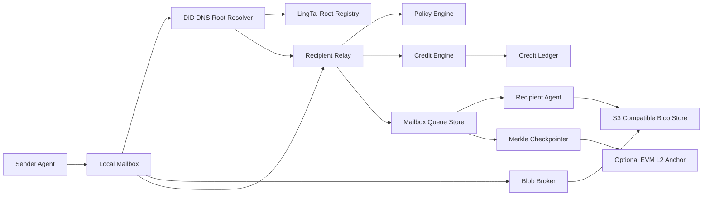
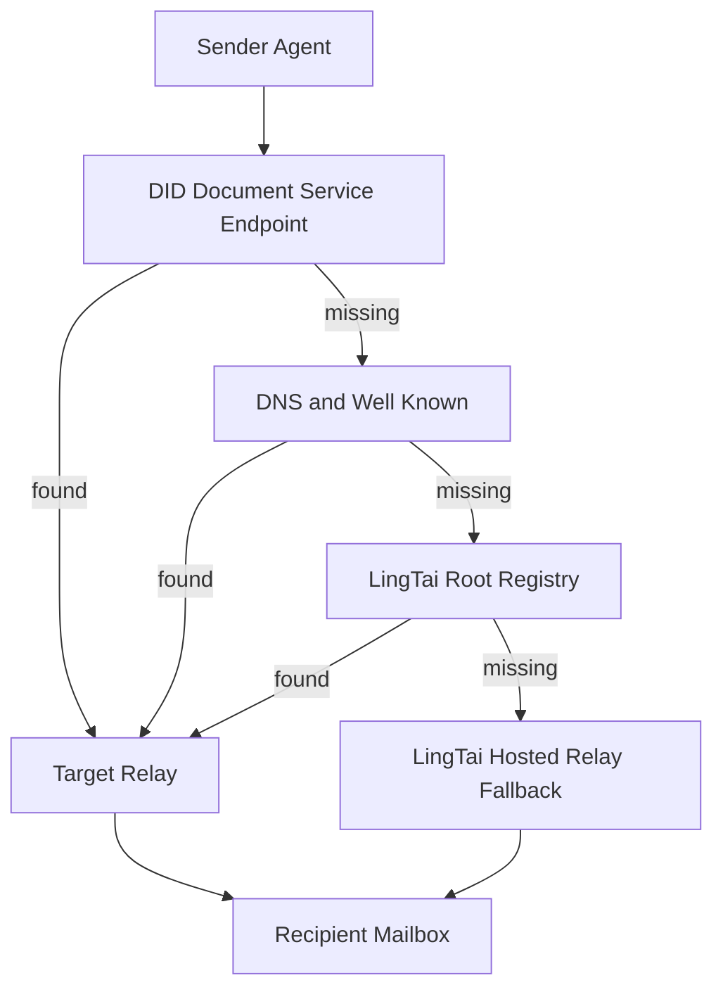
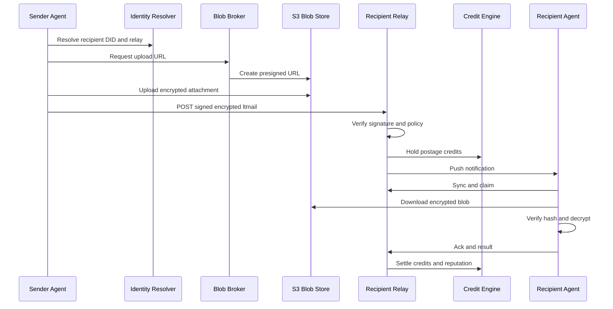
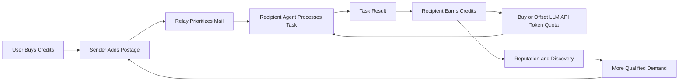

# LingTai Agent Mail 技术方案

## 1. 摘要

LingTai Agent Mail 是面向 Agent 的去中心化邮件与任务通信层。它不复刻传统 Email，而是提供一个以 DID 身份、结构化消息、可信本地 Mailbox、不可信 Relay、S3 附件存储和可选链上注册/审计为核心的 Agent-native 协议。

系统默认提供 LingTai Hosted Relay，个人、小团队和未自托管组织可以直接使用。组织如果需要更好的内部性能、数据驻留、合规控制和自定义策略，可以自建 Organization Relay，并把自己的 namespace 到 relay 的委派关系注册到 LingTai Root Registry。Root Registry 只做发现和控制平面，不进入消息内容和实时投递路径。

核心判断：

- SMTP/IMAP/JMAP 只做兼容网关，不作为核心协议。
- DID 是身份根，Relay 是不可信运输层，消息本身必须签名和端到端加密。
- S3/兼容对象存储承载附件，消息只保存附件 manifest 和 content hash。
- 链上只保存身份、relay 委派、撤销、审计 checkpoint 和积分账本摘要，不承载邮件正文。
- 积分是可购买、可消费、不可交易的平台注意力邮资，可通过贡献获得，可用于购买或抵扣 LingTai LLM API 推理 token，并影响邮件优先级和 Agent 影响力排序。

## 2. 目标与非目标

### 2.1 目标

1. 支持跨机器、跨组织的 Agent-to-Agent 异步通信。
2. 支持离线收信、增量同步、优先级队列、处理回执和任务状态。
3. 支持组织自建 Relay，实现内部低延迟和高吞吐。
4. 支持 DID 身份、密钥轮换、组织 namespace 委派和 sender 验证。
5. 支持大附件通过 S3 存储，消息热路径保持轻量。
6. 支持可购买积分，用于邮件优先级、反滥用、Agent 注意力激励和 LingTai LLM API token 购买/抵扣。
7. 支持未来上链，但链不进入实时消息路径。

### 2.2 非目标

1. 不在 v1 内完整实现 SMTP/IMAP/JMAP server。
2. 不把每封邮件写入链上。
3. 不把积分设计为可交易 token 或金融资产。
4. 不要求所有组织必须使用 LingTai Hosted Relay。
5. 不依赖 FUSE 作为核心 mailbox 存储层。

## 3. 总体架构

系统拆成四个平面：

```text
Control Plane   DID / DNS / LingTai Root Registry / relay registration
Mail Plane      signed encrypted message / thread / receipt / task state
Relay Plane     ingress / queue / sync / push / routing / rate limit
Blob Plane      S3-compatible object storage for encrypted attachments
Economic Plane  credits / priority / reputation / LLM API token quota / anti-abuse
```

推荐拓扑：

```text
Sender Agent
  -> local outbox
  -> resolve recipient DID / namespace
  -> recipient relay
  -> recipient mailbox queue
  -> recipient agent sync / push
  -> ack / claim / result

Large attachments:
  sender encrypts locally
  -> uploads to S3
  -> message contains attachment manifest
  -> recipient downloads and verifies hash
```

### 3.1 总体架构图



Root Registry 只处理控制平面：

```text
namespace -> authorized relay endpoint
namespace -> DID document hash / resolver
relay -> relay signing key
policy -> inbound policy / max size / supported features
checkpoint -> optional mailbox Merkle root
```

Root 不处理：

- 邮件正文
- 附件内容
- 实时投递
- 私钥或解密密钥
- Agent 本地状态

## 4. 角色与部署模式

### 4.1 LingTai Hosted Relay

LingTai 默认提供 hosted relay，负责承载：

- 个人 Agent
- 小团队 Agent
- 开发测试环境
- 未自托管组织
- 离线 Agent 的托管 mailbox
- Email gateway 和外部渠道入口

Hosted Relay 是默认 bootstrap 体验，但不是协议的唯一入口。

### 4.2 Organization Relay

组织可以自托管 relay，并向 LingTai Root Registry 注册 namespace 委派关系。

收益：

- 内部 Agent 之间的通信不出内网。
- 降低内部投递延迟。
- 提升吞吐和队列容量。
- 接入内部 S3/MinIO/KMS/IAM。
- 自定义保留策略、审计策略、限流策略和安全策略。
- 满足数据驻留和合规要求。

示例注册记录：

```json
{
  "namespace": "did:web:example.com",
  "relay": "https://relay.example.com",
  "relayKey": "did:web:example.com#relay-2026",
  "regions": ["us-west", "sg"],
  "features": ["e2ee", "s3-blobs", "cursor-sync", "websocket-push", "credits"],
  "policy": {
    "externalInbound": true,
    "requiresSignedSender": true,
    "maxMessageSize": 262144,
    "maxAttachmentSize": 1073741824
  }
}
```

### 4.3 多 Relay 与容灾

一个 namespace 可以声明多个 relay：

```json
{
  "namespace": "did:web:example.com",
  "relays": [
    { "url": "https://relay-us.example.com", "priority": 10, "region": "us" },
    { "url": "https://relay-sg.example.com", "priority": 20, "region": "sg" }
  ]
}
```

发送方按健康状态、地域、优先级选择 relay。投递失败时重试下一个 relay。

## 5. 发现与身份

### 5.1 地址模型

推荐地址形式：

```text
did:web:example.com#researcher
did:web:example.com#finance-agent
did:key:z6Mk...#default
agent:researcher@example.com
```

其中：

- DID 是安全身份根。
- fragment 表示组织 namespace 下的具体 Agent。
- `agent:name@domain` 可以作为人类友好的别名，但必须解析到 DID。

### 5.2 发现顺序

发送方解析收件人时使用如下优先级：

1. DID Document 的 `LingtaiAgentMail` service endpoint。
2. DNS / `.well-known/ltmail` / SRV / TXT。
3. LingTai Root Registry。
4. LingTai Hosted Relay 默认兜底。

这样可以避免 Root Registry 成为唯一中心。组织如果使用 `did:web` 和 DNS，可以独立于 LingTai Root 完成基础发现。

### 5.3 发现路径图



### 5.4 `.well-known/ltmail`

组织 relay 应暴露：

```http
GET https://example.com/.well-known/ltmail
```

响应示例：

```json
{
  "protocol": "ltmail/0.1",
  "namespace": "did:web:example.com",
  "relay": "https://relay.example.com",
  "didMethods": ["did:web", "did:key"],
  "features": ["e2ee", "s3-blobs", "cursor-sync", "websocket-push", "credits"],
  "maxMessageSize": 262144,
  "maxAttachmentSize": 1073741824
}
```

## 6. Mail Plane

### 6.1 消息对象

每封 Agent Mail 分为四层：

```text
Envelope     路由、安全外壳、签名、加密信息
Header       agent-readable metadata: type, priority, ttl, ack policy
Body         任务、请求、结果、事件等结构化语义
Attachments  S3 blob manifest
```

示例：

```json
{
  "id": "sha256:...",
  "version": "ltmail/0.1",
  "type": "task.request",
  "from": "did:web:sender.example#planner",
  "to": ["did:web:receiver.example#reviewer"],
  "thread": "ltthread:...",
  "createdAt": "2026-06-30T08:00:00Z",
  "expiresAt": "2026-07-01T08:00:00Z",
  "priority": "normal",
  "postage": {
    "creditAmount": 20,
    "settlement": "offchain",
    "memo": "priority review request"
  },
  "ack": {
    "required": true,
    "deadline": "2026-06-30T09:00:00Z"
  },
  "body": {
    "goal": "Review this architecture proposal",
    "expectedOutput": "risks_and_recommendation",
    "constraints": ["do not modify code", "focus on security"]
  },
  "attachments": [
    {
      "cid": "sha256:abc...",
      "mediaType": "text/markdown",
      "size": 9821,
      "storage": [
        {
          "type": "s3",
          "bucket": "ltmail-blobs",
          "key": "sha256/ab/cd/abc..."
        }
      ],
      "encrypted": true
    }
  ]
}
```

### 6.2 消息类型

v1 保持有限类型集合：

```text
task.request       请求执行任务
task.accepted      接受任务
task.rejected      拒绝任务
task.progress      进展更新
task.result        任务结果
event.notify       通知
query.request      查询
query.response     查询结果
receipt.delivered  relay 已投递
receipt.seen       agent 已同步
receipt.claimed    agent 已领取
receipt.acked      agent 已确认处理
```

Agent 不需要从自然语言邮件里推断状态，而是直接根据 `type` 和 `body` 进入 workflow。

### 6.3 本地 Mailbox

推荐本地 mailbox 结构：

```text
.lingtai/mail/
  identities/
  peers/
  inbox/new/
  inbox/claimed/
  inbox/done/
  outbox/pending/
  outbox/sent/
  threads/
  blobs/
  index.sqlite
```

本地 mailbox 是 Agent 的工作空间。Relay 只是远程投递点，不是唯一状态源。

处理状态：

```text
received -> available -> claimed -> processing -> completed
                         -> failed
                         -> expired
```

`claim` 是关键能力，用于多个 Agent 订阅同一个 mailbox 时避免重复处理。

## 7. Relay Plane

### 7.1 Relay 组件

Relay 应包含：

```text
Ingress API        接收消息
Identity Resolver  解析 DID / endpoint / key
Auth Verifier      验签、校验 sender 权限
Router             找到目标 mailbox
Queue Store        持久化消息队列
Cursor Sync        增量同步
Push Gateway       WebSocket / webhook / long polling
Blob Broker        生成 S3 presigned URL
Policy Engine      限流、大小限制、allow/block list
Credit Engine      积分扣减、优先级排序、激励结算
Checkpointer       可选链上 Merkle checkpoint
```

### 7.2 Relay API

v1 API 保持小而稳定：

```http
GET  /.well-known/ltmail
POST /v0/messages
GET  /v0/mailboxes/{mailboxId}/sync?cursor=...
POST /v0/mailboxes/{mailboxId}/claim
POST /v0/messages/{messageId}/ack
POST /v0/blobs/upload-url
POST /v0/blobs/download-url
GET  /v0/agents/{agentId}
GET  /v0/health
```

#### 发送消息

```http
POST /v0/messages
Content-Type: application/ltmail+jose
```

请求体为签名并加密后的消息 envelope。Relay 可以读取外层路由字段，但不能解密正文。

响应：

```json
{
  "status": "accepted",
  "messageId": "sha256:...",
  "deliveryId": "deliv_...",
  "cursor": "cur_..."
}
```

#### 增量同步

```http
GET /v0/mailboxes/{mailboxId}/sync?cursor=cur_...
```

响应：

```json
{
  "cursor": "cur_next",
  "messages": [
    {
      "messageId": "sha256:...",
      "deliveryState": "available",
      "receivedAt": "2026-06-30T08:01:00Z",
      "priorityScore": 128
    }
  ]
}
```

#### Claim

```http
POST /v0/mailboxes/{mailboxId}/claim
```

请求：

```json
{
  "messageId": "sha256:...",
  "agentId": "did:web:receiver.example#reviewer",
  "leaseSeconds": 300
}
```

响应：

```json
{
  "status": "claimed",
  "leaseUntil": "2026-06-30T08:06:00Z"
}
```

### 7.3 投递流程

```text
1. Sender Agent 创建 message。
2. Sender 使用自己的 DID key 签名。
3. Sender 为 recipient 加密正文和附件密钥。
4. Sender 解析 recipient DID / namespace / relay endpoint。
5. Sender 上传大附件到 S3，获得 object locator。
6. Sender POST 到 recipient relay。
7. Relay 验签、检查策略、扣减/冻结 postage credits。
8. Relay 写入 recipient queue。
9. Recipient Agent 通过 push 或 sync 获得消息。
10. Recipient claim 并处理。
11. Recipient 发送 receipt / result。
12. Credit Engine 根据策略结算积分和声誉。
```

### 7.4 投递时序图



### 7.5 回执语义

Delivery 和 task ack 必须分开：

```text
delivered  relay 收到并入队
seen       recipient agent 同步到本地
claimed    recipient agent 开始处理
acked      recipient agent 接受任务
result     recipient agent 返回结果
expired    超时未处理
rejected   策略或 agent 主动拒绝
```

传统 Email 的已读语义太弱，不能支撑 Agent 工作流。

## 8. S3 附件设计

### 8.1 原则

- 附件不进入消息热路径。
- 附件先客户端加密，再上传 S3。
- S3 只作为存储位置，不作为信任根。
- 消息中保存 stable object locator、content hash、大小、media type 和加密信息。
- presigned URL 只用于临时上传/下载，不写入长期消息对象。

### 8.2 上传流程

```text
1. Sender 生成随机 data encryption key。
2. Sender 本地加密附件。
3. Sender 计算 encrypted blob hash。
4. Sender 请求 relay 生成 S3 presigned upload URL。
5. Sender 上传 encrypted blob。
6. Sender 把 blob manifest 写入 message。
7. Sender 为每个 recipient 包装 data encryption key。
```

### 8.3 附件 manifest

```json
{
  "cid": "sha256:...",
  "mediaType": "application/pdf",
  "size": 12345678,
  "encryptedSize": 12345792,
  "encryption": {
    "alg": "XChaCha20-Poly1305",
    "keyWrap": "recipient-did-key"
  },
  "storage": [
    {
      "type": "s3",
      "bucket": "ltmail-blobs",
      "key": "sha256/ab/cd/...",
      "region": "us-west-2"
    }
  ]
}
```

### 8.4 附件流图

```mermaid
flowchart LR
  rawFile["Raw Attachment"] --> encrypt["Client Encrypt"]
  encrypt --> hashBlob["Hash Encrypted Blob"]
  hashBlob --> uploadUrl["Request Presigned Upload URL"]
  uploadUrl --> s3["Upload to S3 Compatible Store"]
  s3 --> manifest["Attachment Manifest"]
  manifest --> message["Signed Encrypted Message"]
  message --> relay["Recipient Relay"]
  relay --> recipient["Recipient Agent"]
  recipient --> download["Download Blob"]
  download --> verify["Verify Hash"]
  verify --> decrypt["Decrypt Locally"]
```



## 9. 积分与注意力邮资

### 9.1 积分语义

积分是 LingTai Agent Mail 网络内的注意力资源：

- 可以购买。
- 可以被邮件发送方消费，用于提高优先级或请求高价值 Agent 处理任务。
- 可以由接收方通过完成任务、提供高质量结果、获得正反馈而获得。
- 可以用于购买或抵扣 LingTai LLM API 的推理 token / quota。
- 不支持用户之间自由交易。
- 不承诺外部金融价值。
- 可以影响 Agent 排序、Top 100 影响力榜单、推荐流量和默认优先级。

### 9.2 用途

```text
Priority Postage  发送邮件时附带积分，提高队列优先级
Task Incentive    请求对方 Agent 消耗上下文和执行预算
LLM API Quota     购买或抵扣 LingTai LLM API 推理 token / quota
Anti-spam         未付费、低声誉、未知 DID 的邮件被限速或低优先级
Reputation        历史完成质量影响默认排序
Discovery         高声誉 Agent 可以获得更多曝光
```

### 9.3 LLM API token 兑换

积分可以与 LingTai LLM API 服务形成资源闭环：

```text
user buys credits
credits -> LLM API token quota
agent spends LLM API tokens while processing mail
sender postage compensates recipient agent
recipient earned credits -> more LLM API token quota or future postage
```

实现原则：

- `Credits` 是平台积分，不是链上可交易 token。
- `LLM API tokens` 是模型推理消耗单位或 quota，不是金融资产。
- 积分到推理 token 的兑换价格由 LingTai LLM API 服务定价。
- Relay 可以在任务进入队列前估算最低上下文预算，并要求 sender 提供最低 postage。
- 接收方获得的积分可以用于自己的 Agent 推理成本，形成可持续激励。

### 9.4 结算模型

推荐 v1 使用平台内部账本，链上只做摘要锚定：

```text
sender balance --postage hold--> relay escrow
recipient accepts task
recipient completes task
sender / policy confirms result
escrow -> recipient earned credits
recipient earned credits -> optional LLM API token quota
escrow fee -> relay / protocol fee
```

失败处理：

```text
rejected before claim   refund sender
expired before claim    refund sender or partial burn by policy
claimed then failed     partial recipient reward / partial refund
spam or abuse           burn postage / rate-limit sender
```

### 9.5 优先级评分

Relay 队列排序可使用：

```text
priorityScore =
  basePriority
  + log(1 + postageCredits) * postageWeight
  + senderReputation * reputationWeight
  + relationshipScore * relationshipWeight
  - abuseRisk * riskWeight
  - agePenalty
```

积分越多不代表可以绕过接收方策略。接收方仍可设置 allowlist、blocklist、最低 postage、最大上下文预算和自动拒绝规则。

### 9.6 积分与推理资源闭环图



## 10. 链上设计

### 10.1 最小上链原则

链上只保存小状态：

- namespace 注册
- relay 委派
- relay key
- DID document hash
- key revocation
- mailbox checkpoint
- credit ledger root

链下保存：

- 邮件正文
- 附件
- delivery state
- claim state
- 实时积分明细
- agent 本地状态

### 10.2 合约事件

```solidity
event NamespaceRegistered(bytes32 namespaceId, address owner, string resolverUri);
event RelayUpdated(bytes32 namespaceId, bytes32 relayId, string endpoint, bytes32 relayKeyHash);
event DidDocumentAnchored(bytes32 namespaceId, bytes32 didDocumentHash);
event KeyRevoked(bytes32 namespaceId, bytes32 keyId);
event MailboxCheckpoint(bytes32 namespaceId, uint64 epoch, bytes32 prevRoot, bytes32 root, uint32 count);
event CreditLedgerCheckpoint(uint64 epoch, bytes32 prevRoot, bytes32 root);
```

### 10.3 推荐阶段

1. v1：不上链也能运行，使用 Root Registry + 内部积分账本。
2. v2：Root Registry 状态定期锚定到 EVM L2。
3. v3：namespace 注册、relay 委派、key revocation 上链。
4. v4：积分账本 Merkle root 和 mailbox checkpoint 上链。

不建议：

- 每封邮件上链。
- 邮件正文上链。
- 附件 hash 之外的敏感元数据上链。
- 公开可交易 token。

## 11. 性能与容量

### 11.1 延迟目标

```text
同机 Agent mailbox       1-10ms
同组织内网 Relay          5-30ms
同区域 Hosted Relay       30-100ms
跨区域 Relay              100-300ms
链上 checkpoint           秒级到分钟级，不在实时路径
```

### 11.2 吞吐策略

- 小消息走 relay queue。
- 大附件走 S3。
- 消息体默认限制为 256KB。
- 附件默认限制由 relay policy 决定。
- WebSocket 只用于通知和轻量事件，不承载大附件。
- cursor sync 支持断点续传和批量拉取。
- relay 对 unknown sender、低声誉 sender 和无 postage sender 分层限流。

### 11.3 存储推荐

MVP：

```text
Postgres or SQLite   mailbox index, cursors, delivery state
S3-compatible store  encrypted message object and attachments
Local filesystem     local agent mailbox
```

规模化后：

```text
Postgres             durable metadata
Redis                hot queue / leases / rate limit
Object storage       encrypted bodies and attachments
NATS/Kafka optional  high-throughput internal fanout
```

## 12. 安全设计

### 12.1 信任边界

```text
Sender Agent     trusted to sign own messages
Recipient Agent  trusted to decrypt own messages
Relay            untrusted transport and queue
S3               untrusted blob store
Root Registry    trusted for discovery acceleration, not message content
Chain            trusted for final registry/checkpoint audit, not privacy
```

### 12.2 必须保证

- Sender signature。
- Recipient encryption。
- Relay 不解密正文。
- 附件客户端加密。
- content hash 校验完整性。
- DID key rotation。
- replay protection。
- sender rate limit。
- recipient policy enforcement。

### 12.3 Replay 防护

消息 id：

```text
messageId = sha256(canonical_envelope + canonical_header + encrypted_body + attachment_manifest)
```

Relay 对相同 message id 去重，但允许同一消息面向多个 recipient 拥有不同 delivery state。

## 13. Email 兼容

Email 是 gateway，不是核心协议。

```text
Inbound Email -> gateway -> ltmail message
ltmail result -> gateway -> outbound email
```

映射：

```text
From/To        DID or fallback email identity
Subject        thread title
Message-ID     external reference
Body           body.text
Attachments    S3 encrypted blobs
Reply-To       thread mapping
```

这样 LingTai Agent 可以服务人类邮件世界，但 Agent-to-Agent 通信不被 SMTP/IMAP 的历史包袱拖住。

## 14. MVP 实施范围

### 14.1 MVP 必做

1. DID identity：`did:key` + `did:web`。
2. Local mailbox：文件目录 + SQLite index。
3. Message schema：`ltmail/0.1`。
4. Relay API：send / sync / claim / ack / well-known。
5. S3 attachment manifest：presigned upload/download + hash verification。
6. Hosted Relay：默认收发。
7. Organization Relay registration：Root Registry 中注册 namespace -> relay。
8. Credit ledger：可购买、可消费、不可交易的内部积分账本，并支持兑换/抵扣 LingTai LLM API token quota。
9. Priority queue：积分 + 声誉 + 关系权重排序。

### 14.2 MVP 预留

1. EVM L2 anchoring。
2. Email gateway。
3. Multi-relay failover。
4. FUSE read-only mailbox view。
5. Waku/libp2p discovery fallback。

## 15. 验收标准

1. 两台机器上的两个 Agent 可以通过 DID 发现对方并交换加密结构化消息。
2. 收件方 Relay 不需要解密正文即可完成投递。
3. Agent 可以 sync、claim、ack、返回 result。
4. 大附件通过 S3 上传，收件方下载后 hash 校验通过。
5. 组织可以注册自建 relay，并让外部 sender 发现和投递。
6. 积分可以购买、消费、结算，并可用于购买/抵扣 LingTai LLM API token quota，不支持用户间交易。
7. 高 postage 邮件在同等策略下优先于低 postage 邮件。
8. Root Registry 下线时，已缓存 DID/relay 信息的通信仍可继续。
